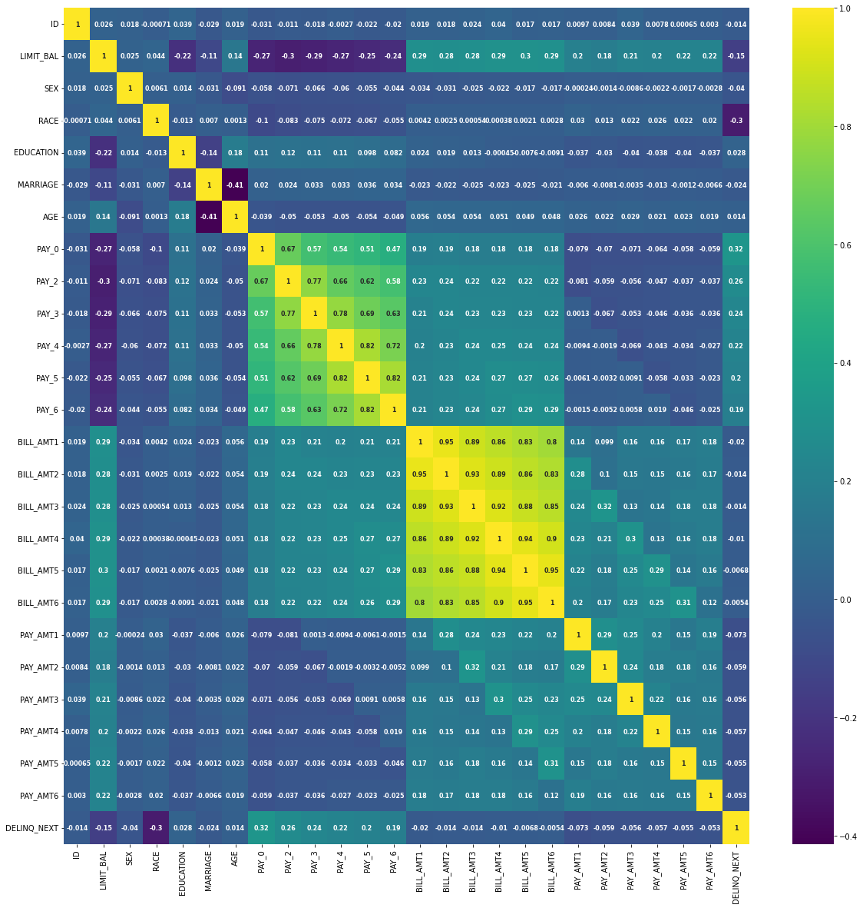
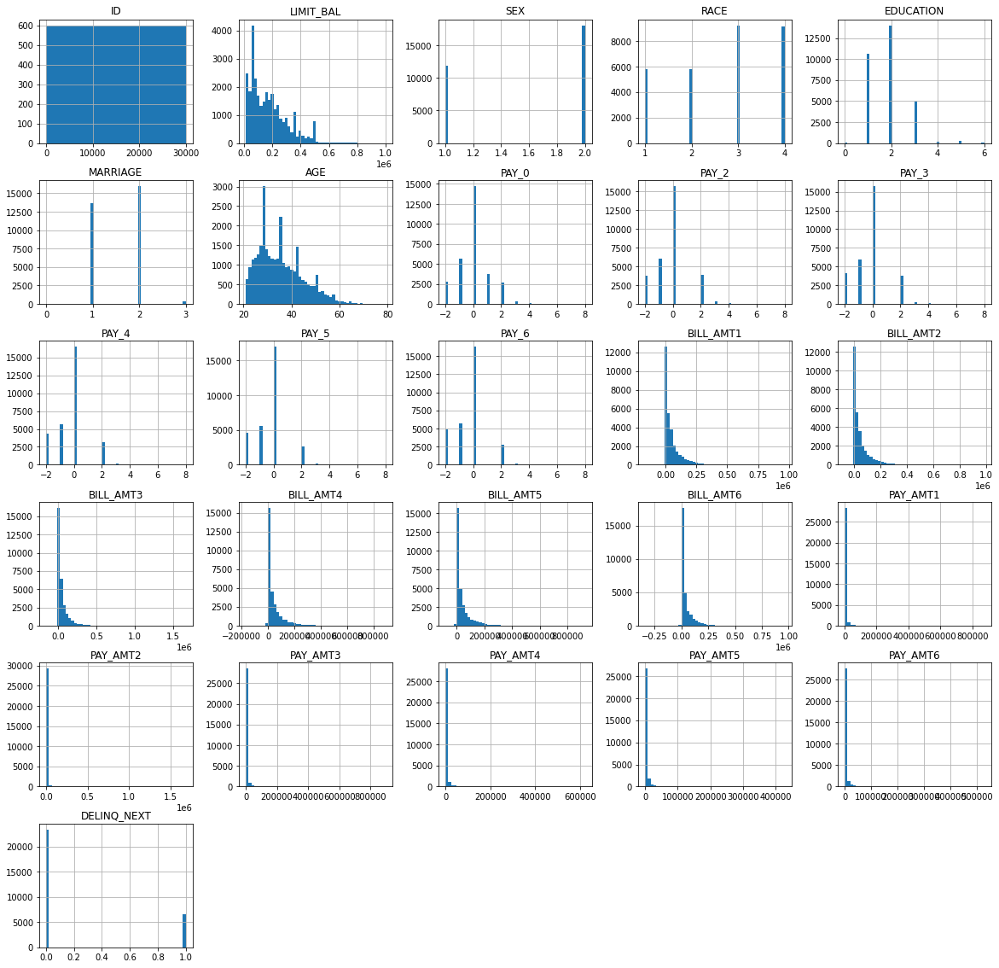
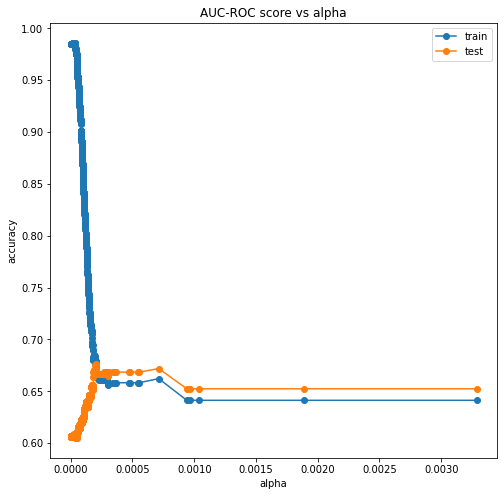
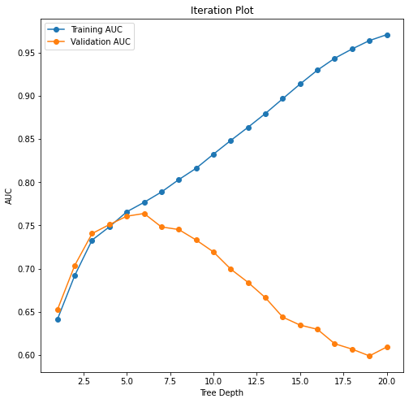
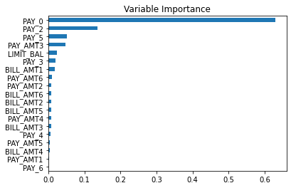
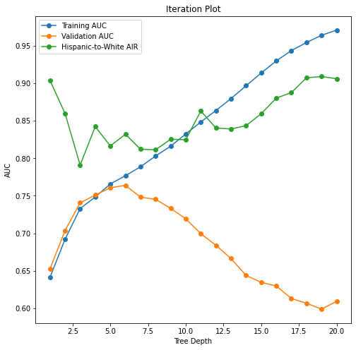

# DNSC 6301 Project Model Card

## Basic Information

* **Person or organization developing model**: Shih Wei Pan, `shihwei.pan@gwu.edu`
* **Model date**: August, 2022
* **Model version**: 1.0
* **License**: MIT
* **Model implementation code**: [DNSC_6301_Project.ipynb](DNSC_6301_Project.ipynb)

### Intended Use
* **Primary intended uses**: This model is an *example* probability of default classifier, with an *example* use case for determining eligibility for a credit line increase.
* **Primary intended users**: Students in GWU DNSC 6301 bootcamp.
* **Out-of-scope use cases**: Any use beyond an educational example is out-of-scope.

## Training Data

* Data dictionary: 

| Name | Modeling Role | Measurement Level| Description|
| ---- | ------------- | ---------------- | ---------- |
|**ID**| ID | int | unique row indentifier |
| **LIMIT_BAL** | input | float | amount of previously awarded credit |
| **SEX** | demographic information | int | 1 = male; 2 = female
| **RACE** | demographic information | int | 1 = hispanic; 2 = black; 3 = white; 4 = asian |
| **EDUCATION** | demographic information | int | 1 = graduate school; 2 = university; 3 = high school; 4 = others |
| **MARRIAGE** | demographic information | int | 1 = married; 2 = single; 3 = others |
| **AGE** | demographic information | int | age in years |
| **PAY_0, PAY_2 - PAY_6** | inputs | int | history of past payment; PAY_0 = the repayment status in September, 2005; PAY_2 = the repayment status in August, 2005; ...; PAY_6 = the repayment status in April, 2005. The measurement scale for the repayment status is: -1 = pay duly; 1 = payment delay for one month; 2 = payment delay for two months; ...; 8 = payment delay for eight months; 9 = payment delay for nine months and above |
| **BILL_AMT1 - BILL_AMT6** | inputs | float | amount of bill statement; BILL_AMNT1 = amount of bill statement in September, 2005; BILL_AMT2 = amount of bill statement in August, 2005; ...; BILL_AMT6 = amount of bill statement in April, 2005 |
| **PAY_AMT1 - PAY_AMT6** | inputs | float | amount of previous payment; PAY_AMT1 = amount paid in September, 2005; PAY_AMT2 = amount paid in August, 2005; ...; PAY_AMT6 = amount paid in April, 2005 |
| **DELINQ_NEXT**| target | int | whether a customer's next payment is delinquent (late), 1 = late; 0 = on-time |

* **Source of training data**: GWU Blackboard, email `jphall@gwu.edu` for more information
* **How training data was divided into training and validation data**: 60% training, 20% validation, 20% test
* **Number of rows in training and validation data**:
  * Training rows: 18,000
  * Validation rows: 6,000

## Test Data
* **Source of test data**: GWU Blackboard, email `jphall@gwu.edu` for more information
* **Number of rows in test data**: 6,000
* **State any differences in columns between training and test data**: None

## Model details
* **Columns used as inputs in the final model**: 'LIMIT_BAL',
       'PAY_0', 'PAY_2', 'PAY_3', 'PAY_4', 'PAY_5', 'PAY_6', 'BILL_AMT1',
       'BILL_AMT2', 'BILL_AMT3', 'BILL_AMT4', 'BILL_AMT5', 'BILL_AMT6',
       'PAY_AMT1', 'PAY_AMT2', 'PAY_AMT3', 'PAY_AMT4', 'PAY_AMT5', 'PAY_AMT6'
* **Column(s) used as target(s) in the final model**: 'DELINQ_NEXT'
* **Type of model**: Decision Tree 
* **Software used to implement the model**: Python, scikit-learn
* **Version of the modeling software**: Python==3.7.13; scikit-learn==1.0.2
* **Hyperparameters or other settings of your model**: 
```
DecisionTreeClassifier(ccp_alpha=0.0, class_weight=None, criterion='gini',
                       max_depth=6, max_features=None, max_leaf_nodes=None,
                       min_impurity_decrease=0.0, min_impurity_split=None,
                       min_samples_leaf=1, min_samples_split=2,
                       min_weight_fraction_leaf=0.0, presort='deprecated',
                       random_state=99, splitter='best')`
```

## Quantitative Analysis

### Correlation Heatmap


### Variable Histograms


## Model Experiment

### Post-Pruning : ALPHA


### Cross Validation : DEPTH


#### Test Detail
| Depth | Training AUC | Validation AUC | 5-Fold SD |
|------:|-------------:|---------------:|----------:|
|     1 |     0.641367 |       0.652452 |  0.007965 |
|     2 |     0.692113 |       0.703766 |  0.014767 |
|     3 |     0.733044 |       0.740628 |  0.009125 |
|     4 |    	0.748443 |      	0.751006 | 	0.008237 |
|     5 |    	0.765782 |      	0.760682 | 	0.013529 |
|     6 |    	0.776733 |      	0.763840 | 	0.019140 |
|     7 |    	0.788668 |      	0.748281 | 	0.014854 |
|     8 |    	0.802992 |      	0.745292 | 	0.017962 |
|     9 |    	0.816080 |      	0.733223 | 	0.019062 |
|    10 |    	0.832419 |      	0.719415 | 	0.009521 |
|    11 |    	0.848311 |      	0.699499 | 	0.014901 |
|    12 |    	0.863631 |      	0.684096 | 	0.009305 |
|    13 |    	0.879547 |      	0.666395 | 	0.013229 |
|    14 |    	0.896630 |      	0.643944 | 	0.018922 |
|    15 |    	0.913592 |      	0.634721 | 	0.015617 |
|    16 |    	0.929671 |      	0.629846 | 	0.018662 |
|    17 |    	0.943429 |      	0.613150 | 	0.023878 |
|    18 |    	0.954195 |      	0.606919 | 	0.017963 |
|    19 |    	0.963902 |      	0.599065 | 	0.017561 |
|    20 |    	0.970715 |      	0.609386 | 	0.010017 |

* **Best Parameters** : **max_depth = 6**
* **Test Data AUC** :  **0.7476**

### Variable Importance


### Bias Remediation

* **Suitable cutoff value according to test results** : **0.2**
#### Test Detail
```
Accuracy at cutoff 0.00 is: 0.2315, difference : 0.2315
Accuracy at cutoff 0.01 is: 0.2315, difference : 0.0000
Accuracy at cutoff 0.02 is: 0.2315, difference : 0.0000
Accuracy at cutoff 0.03 is: 0.2315, difference : 0.0000
Accuracy at cutoff 0.04 is: 0.2315, difference : 0.0000
Accuracy at cutoff 0.05 is: 0.2315, difference : 0.0000
Accuracy at cutoff 0.06 is: 0.2322, difference : 0.0007
Accuracy at cutoff 0.07 is: 0.2322, difference : 0.0000
Accuracy at cutoff 0.08 is: 0.5347, difference : 0.3025
Accuracy at cutoff 0.09 is: 0.5347, difference : 0.0000
Accuracy at cutoff 0.10 is: 0.5347, difference : 0.0000
Accuracy at cutoff 0.11 is: 0.5562, difference : 0.0215
Accuracy at cutoff 0.12 is: 0.5562, difference : 0.0000
Accuracy at cutoff 0.13 is: 0.5562, difference : 0.0000
Accuracy at cutoff 0.14 is: 0.5562, difference : 0.0000
Accuracy at cutoff 0.15 is: 0.6883, difference : 0.1322
Accuracy at cutoff 0.16 is: 0.6883, difference : 0.0000
Accuracy at cutoff 0.17 is: 0.6935, difference : 0.0052
Accuracy at cutoff 0.18 is: 0.6935, difference : 0.0000
Accuracy at cutoff 0.19 is: 0.6935, difference : 0.0000
Accuracy at cutoff 0.20 is: 0.7630, difference : 0.0695
Accuracy at cutoff 0.21 is: 0.7772, difference : 0.0142
Accuracy at cutoff 0.22 is: 0.7813, difference : 0.0042
Accuracy at cutoff 0.23 is: 0.7813, difference : 0.0000
Accuracy at cutoff 0.24 is: 0.7900, difference : 0.0087
Accuracy at cutoff 0.25 is: 0.7908, difference : 0.0008
Accuracy at cutoff 0.26 is: 0.7908, difference : 0.0000
Accuracy at cutoff 0.27 is: 0.7908, difference : 0.0000
Accuracy at cutoff 0.28 is: 0.7952, difference : 0.0043
Accuracy at cutoff 0.29 is: 0.7952, difference : 0.0000
Accuracy at cutoff 0.30 is: 0.7948, difference : -0.0003
```

#### Plot with tree depth, training and validation AUC, AIR


#### Test Detail
| Depth | Training AUC | Validation AUC | 5-Fold SD | Hispanic-to-White AIR |
|---:|-------------:|---------------:|----------:| --------------------: |
|1|0.641367| 	0.652452| 	0.007965| 	0.903757|
|2|0.692113| 	0.703766| 	0.014767| 	0.859659|
|3|0.733044| 	0.740628| 	0.009125| 	0.790934|
|4|0.748443| 	0.751006| 	0.008237| 	0.842215|
|5|0.765782| 	0.760682| 	0.013529| 	0.816429|
|6|0.776733| 	0.763840| 	0.019140| 	0.831999|
|7|0.788668| 	0.748281| 	0.014854| 	0.812137|
|8|0.802992| 	0.745292| 	0.017962| 	0.811290|
|9|0.816080| 	0.733223| 	0.019062| 	0.825349|
|10|0.832419| 	0.719415| 	0.009521| 	0.824719|
|11|0.848311| 	0.699499| 	0.014901| 	0.862977|
|12|0.863631| 	0.684096| 	0.009305| 	0.840306|
|13|0.879547| 	0.666395| 	0.013229| 	0.839040|
|14|0.896630| 	0.643944| 	0.018922| 	0.843479|
|15|0.913592| 	0.634721| 	0.015617| 	0.859287|
|16|0.929671| 	0.629846| 	0.018662| 	0.880159|
|17|0.943429| 	0.613150| 	0.023878| 	0.887453|
|18|0.954195| 	0.606919| 	0.017963| 	0.907257|
|19|0.963902| 	0.599065| 	0.017561| 	0.908921|
|20|0.970715| 	0.609386| 	0.010017| 	0.905950|

## Ethical considerations

### Describe potential negative impacts of using your model:

＊Python is a open source. If the packages contain the Trojan horse, we may be attacked when we use it. 
＊When we use Python to load confidential data, there is a potential for a data breach.

### Describe potential uncertainties relating to the impacts of using your model:

* The Algorithm was designed without humanity, so the prediction result may not be close to reality.
* Inaccurate prediction results can lead to a decrease in customer confidence in the company.

### Describe any unexpected or results:

* Since the data set used this time does not have null values, the execution will be very smooth, but the real data set in the industry must be full of missing values. In the process of dealing with missing values, the variables of subsequent modeling will be continuously adjusted, whether it is model selection or parameter adjustment. Therefore, whether the results of this model are applicable to the industry remains to be determined.
* From the result of feature importance, the importance of PAY_0 accounts for more than 60%. I personally think that this proportion is a bit abnormal. It is necessary to clarify the relationship between PAY_0 and the target variable (DELINQ_NEXT), and confirm that DELINQ_NEXT and PAY_0 are in the real world. degree of comparability in .
* In terms of model selection, other tree classifier models can be compared together (pipelines), and it is also possible to obtain different AUC and feature importance results.

